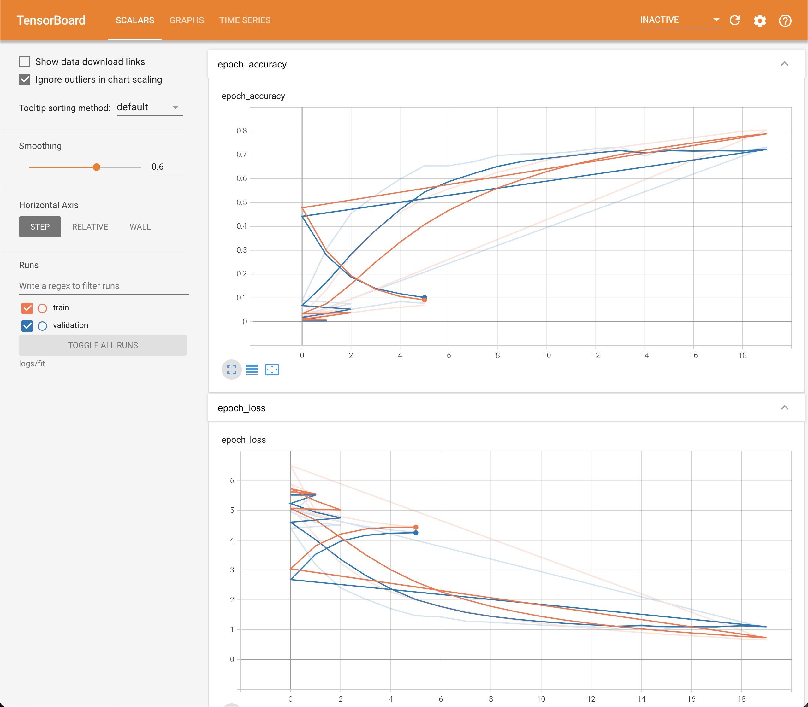
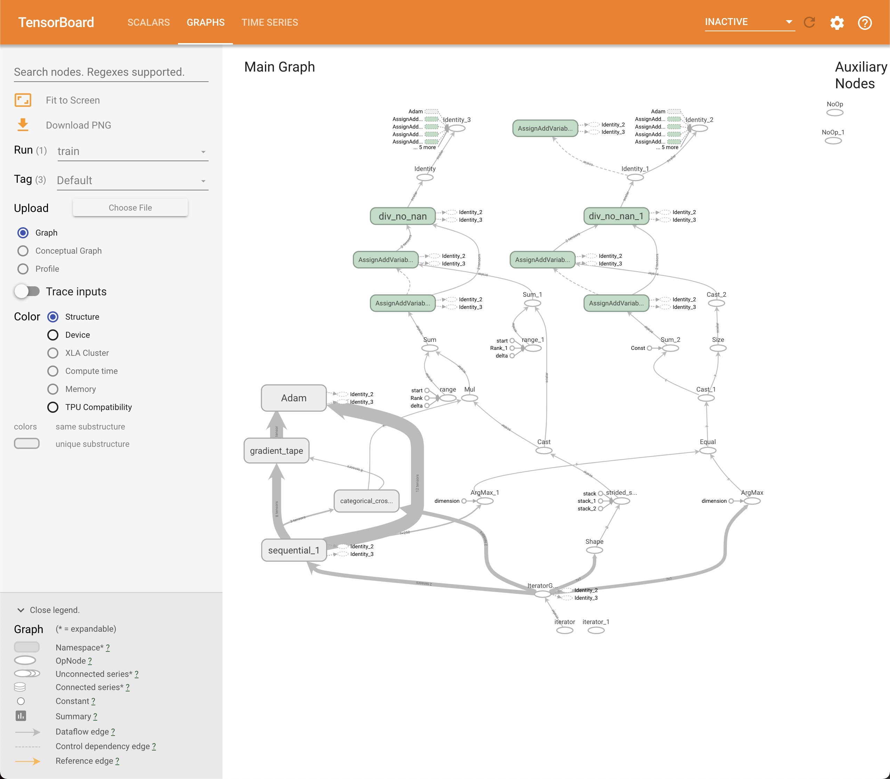
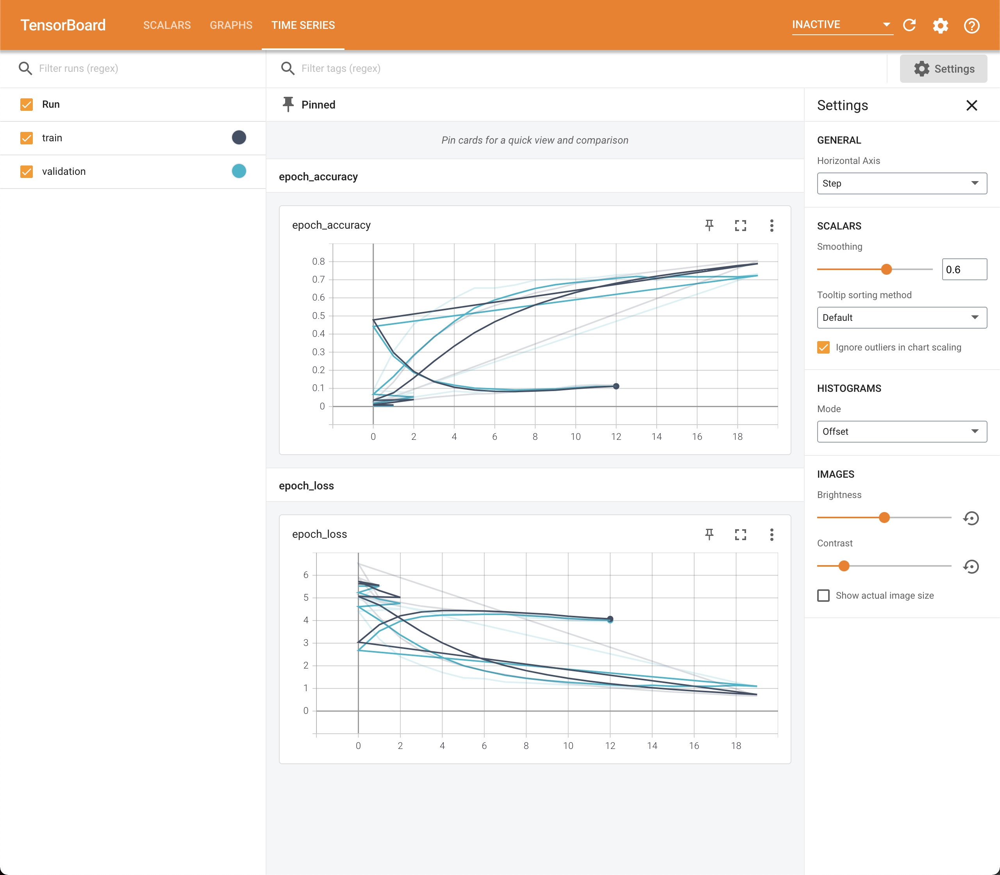

# COE59410- Generative Deep Learning

## Homework 1

> Imran A. Zualkernan

The purpose of this homework is to learn how to use the GPU machines to run large models. In addition, build familiarity with the Keras framework and the associated tools.

## Deliverables

**You need to upload the following on ilearn (2 items)**

1. The Jupyter notebook in its original format.

2. A PDF of the Jupyter notebook for grading.

*Please do not upload a zipped file.* Upload each file separately. Each question is worth 25 points.

* Q1. Load and run the large_scale_processing v1.1 Jupyter notebook on the GPU machine and show how you can use tensorboard to monitor the runs remotely on your local machine.

* Q2. Modify the model in large_scale_processing v1.1 so that rather than a CNN, the model is a fully connected feedforward neural network. Fine tune the model to show your best results. Report and discuss all the results that are necessary to determine the goodness of your best model.

> Hint: Use the Reshape Layer in Keras.

* Q3. Use the following two call-backs on your best fully connected model and determine if you are able to improve the results. Clearly explain why or why not.
    1. LearningRateScheduler
    2. ReduceLROnPlateau

* Q4. Use the Keras Hypertune and Random optimizers (https://keras-team.github.io/keras-tuner/) to determine if you can improve the model by varying the number of layers, neurons in each layer and the learning rate.

    1. Plot the precision vs. recall of the best 20 models in one figure.
    2. Show a complete evaluation of the top two models.

## Group 2
* Eman ,
* Huangjin Zhou, b00080932
* Mueez ,


```python
# Useful links 
# https://www.hostinger.com/tutorials/ssh/basic-ssh-commands
```


```python
from tensorflow.python.client import device_lib
print(device_lib.list_local_devices())
```

    [name: "/device:CPU:0"
    device_type: "CPU"
    memory_limit: 268435456
    locality {
    }
    incarnation: 7024726172452834166
    , name: "/device:GPU:0"
    device_type: "GPU"
    memory_limit: 7491766208
    locality {
      bus_id: 1
      links {
      }
    }
    incarnation: 14096791708320634790
    physical_device_desc: "device: 0, name: Quadro RTX 4000, pci bus id: 0000:01:00.0, compute capability: 7.5"
    ]


```python
import tensorflow as tf
# print(tf.config.list_physical_devices('GPU'))
tf.config.experimental.list_physical_devices('GPU')
tf.config.experimental.list_physical_devices(device_type=None)
tf.test.is_gpu_available()
print(tf.test.is_built_with_cuda())
```

    WARNING:tensorflow:From <ipython-input-3-ca90116ab0f5>:5: is_gpu_available (from tensorflow.python.framework.test_util) is deprecated and will be removed in a future version.
    Instructions for updating:
    Use `tf.config.list_physical_devices('GPU')` instead.
    True


```python
import numpy as np
import pandas as pd
import os
import matplotlib.pyplot as plt
from IPython.display import Image, display
import random
import math
import keras
from keras.preprocessing.text import Tokenizer
from keras.models import Model, Sequential
from keras.utils import plot_model 
from keras.layers import Reshape, Input, Dense, Dropout, Flatten, Activation,Concatenate
from keras.layers import Conv2D, MaxPooling2D, AveragePooling2D
from keras.optimizers import Adam
from keras import backend, models
#import tensorflow_addons as tfa
import tensorflow as tf
print(tf.__version__)

# need to add these for the GPU
config = tf.compat.v1.ConfigProto()
config.gpu_options.allow_growth = True
session = tf.compat.v1.Session(config=config)
```

    2.4.1


```python
# import the image generator
from tensorflow.keras.preprocessing.image import ImageDataGenerator
```


```python
#Setting the parameters for training

# batch size and image width to use
batch_size=128
width=100

# all the data directories
train_dir='train/'
test_dir='test/'
valid_dir='valid/'

# the number of epochs
num_epochs=10

# creating an image generator that will feed the data from
# each of the directories

# we use scaling transformation in this generator
generator=ImageDataGenerator(rescale=1./255)

# we specify the size of the input and batch size
# size of the input is necessary because the image
# needs to be rescaled for the neural network

train_data=generator.flow_from_directory(train_dir, target_size=(width,width),batch_size=batch_size)
valid_data=generator.flow_from_directory(valid_dir, target_size=(width,width),batch_size=batch_size)
test_data=generator.flow_from_directory(test_dir, target_size=(width,width),batch_size=batch_size)

# the number of steps per epoch is samples/batch size
# we need to use these numbers later

train_steps_per_epoch=math.ceil(train_data.samples/batch_size)
valid_steps_per_epoch=math.ceil(valid_data.samples/batch_size)
test_steps_per_epoch=math.ceil(test_data.samples/batch_size)
print(train_steps_per_epoch)
print(valid_steps_per_epoch)
print(test_steps_per_epoch)
```

    Found 35215 images belonging to 250 classes.
    Found 1250 images belonging to 250 classes.
    Found 1250 images belonging to 250 classes.
    276
    10
    10


> Q1. Load and run the large_scale_processing v1.1 Jupyter notebook on the GPU machine and
show how you can use tensorboard to monitor the runs remotely on your local machine.


```shell
$ jupyter notebook --port 9999 --NotebookApp.allow_remote_access=True
$ tensorboard --logdir logs/fit --port=8888
```
> Scalars





```python
Q1 = False
if Q1:
    # the actual model should go here
    model = Sequential()
    model.add(Conv2D(32, (3, 3), input_shape=(width, width, 3), activation='relu'))
    model.add(MaxPooling2D(pool_size=(2, 2)))

    model.add(Conv2D(64, (3, 3), activation='relu'))
    model.add(MaxPooling2D(pool_size=(2, 2)))

    model.add(Dropout(0.5))

    model.add(Conv2D(128, (3, 3), activation='relu'))
    model.add(MaxPooling2D(pool_size=(2, 2)))

    model.add(Conv2D(256, (3, 3), activation='relu'))
    model.add(MaxPooling2D(pool_size=(2, 2)))

    model.add(Flatten())
    model.add(Dense(1024, activation='relu'))
    model.add(Dropout(0.5))
    model.add(Dense(250, activation='softmax'))
    model.summary()
```


```python
if Q1:
    # Compile the model
    model.compile(loss='categorical_crossentropy',
              optimizer='adam',
              metrics=['accuracy'])

    # see if the model is good.
    print(model)
```

```python
if Q1:
    print(valid_steps_per_epoch)
    num_epochs = 20
    # fit model and add tensor board callbacks
    from tensorflow.keras.callbacks import TensorBoard

    tensorboard = TensorBoard(log_dir='../logs/fit')
    history = model.fit(train_data,
                        steps_per_epoch=train_steps_per_epoch,
                        validation_data=valid_data,
                        epochs=num_epochs,
                        validation_steps=valid_steps_per_epoch, callbacks=[tensorboard])
```


Q2. Modify the model in large_scale_processing v1.1 so that rather than a CNN,
the model is a fully connected feedforward neural network.
Fine tune the model to show your best results.
Report and discuss all the results that are necessary to determine the goodness of your best model.


> Hint: Use the Reshape Layer in Keras.
>

| parameter| value | accuracy|
| parameter| value | accuracy|


# since we just try to find the best parameters, so we just try 10 epochs


```python
Q2 = True
num_epochs = 10*10

# try different units

num_labels = train_data.num_classes

hidden_units = 128*8
model = Sequential()
model.add(Reshape((-1,), input_shape=(width, width, 3)))
model.add(Dense(hidden_units, activation='relu'))
model.add(Dense(hidden_units, activation='relu'))
model.add(Dense(hidden_units, activation='relu'))
model.add(Dense(num_labels, activation='softmax'))
model.summary()

# Compile the model
model.compile(loss='categorical_crossentropy',
              optimizer='adam',
              metrics=['accuracy'])

history=model.fit(train_data,
                  steps_per_epoch =train_steps_per_epoch,
                  validation_data=valid_data,
                  epochs=num_epochs,
                  validation_steps=valid_steps_per_epoch)

exit()
```

    Model: "sequential"
    _________________________________________________________________
    Layer (type)                 Output Shape              Param #   
    =================================================================
    reshape (Reshape)            (None, 30000)             0         
    _________________________________________________________________
    dense (Dense)                (None, 1024)              30721024  
    _________________________________________________________________
    dense_1 (Dense)              (None, 1024)              1049600   
    _________________________________________________________________
    dense_2 (Dense)              (None, 1024)              1049600   
    _________________________________________________________________
    dense_3 (Dense)              (None, 250)               256250    
    =================================================================
    Total params: 33,076,474
    Trainable params: 33,076,474
    Non-trainable params: 0
    _________________________________________________________________
    Epoch 1/100
    276/276 [==============================] - 28s 99ms/step - loss: 8.6603 - accuracy: 0.0094 - val_loss: 4.7837 - val_accuracy: 0.0384
    Epoch 2/100
    276/276 [==============================] - 27s 99ms/step - loss: 4.7239 - accuracy: 0.0533 - val_loss: 4.2681 - val_accuracy: 0.0976
    Epoch 3/100
    276/276 [==============================] - 27s 98ms/step - loss: 4.3308 - accuracy: 0.0947 - val_loss: 4.0157 - val_accuracy: 0.1368
    Epoch 4/100
    276/276 [==============================] - 27s 98ms/step - loss: 4.0289 - accuracy: 0.1359 - val_loss: 3.8604 - val_accuracy: 0.1560
    Epoch 5/100
    276/276 [==============================] - 27s 98ms/step - loss: 3.8088 - accuracy: 0.1669 - val_loss: 3.7364 - val_accuracy: 0.1760
    Epoch 6/100
    276/276 [==============================] - 27s 98ms/step - loss: 3.6437 - accuracy: 0.1917 - val_loss: 3.6267 - val_accuracy: 0.1832
    Epoch 7/100
    276/276 [==============================] - 27s 99ms/step - loss: 3.4533 - accuracy: 0.2212 - val_loss: 3.9685 - val_accuracy: 0.1464
    Epoch 8/100
    276/276 [==============================] - 27s 98ms/step - loss: 3.4071 - accuracy: 0.2239 - val_loss: 3.5112 - val_accuracy: 0.2080
    Epoch 9/100
    276/276 [==============================] - 27s 98ms/step - loss: 3.1625 - accuracy: 0.2600 - val_loss: 3.4037 - val_accuracy: 0.2368
    Epoch 10/100
    276/276 [==============================] - 27s 98ms/step - loss: 2.9973 - accuracy: 0.2872 - val_loss: 3.4688 - val_accuracy: 0.2296
    Epoch 11/100
    276/276 [==============================] - 27s 99ms/step - loss: 2.8646 - accuracy: 0.3148 - val_loss: 3.4421 - val_accuracy: 0.2704
    Epoch 12/100
    276/276 [==============================] - 27s 98ms/step - loss: 2.6637 - accuracy: 0.3474 - val_loss: 3.4539 - val_accuracy: 0.2544
    Epoch 13/100
    276/276 [==============================] - 27s 98ms/step - loss: 2.4878 - accuracy: 0.3805 - val_loss: 3.5271 - val_accuracy: 0.2616
    Epoch 14/100
    276/276 [==============================] - 27s 98ms/step - loss: 2.3465 - accuracy: 0.4074 - val_loss: 3.6379 - val_accuracy: 0.2576
    Epoch 15/100
    276/276 [==============================] - 27s 98ms/step - loss: 2.1855 - accuracy: 0.4455 - val_loss: 3.6987 - val_accuracy: 0.2544
    Epoch 16/100
    276/276 [==============================] - 27s 98ms/step - loss: 2.0233 - accuracy: 0.4771 - val_loss: 3.7764 - val_accuracy: 0.2656
    Epoch 17/100
    276/276 [==============================] - 27s 98ms/step - loss: 1.7886 - accuracy: 0.5272 - val_loss: 3.9873 - val_accuracy: 0.2728
    Epoch 18/100
    276/276 [==============================] - 27s 98ms/step - loss: 1.6442 - accuracy: 0.5608 - val_loss: 4.2788 - val_accuracy: 0.2600
    Epoch 19/100
    276/276 [==============================] - 27s 98ms/step - loss: 1.5172 - accuracy: 0.5940 - val_loss: 4.3985 - val_accuracy: 0.2696
    Epoch 20/100
    276/276 [==============================] - 27s 99ms/step - loss: 1.3170 - accuracy: 0.6387 - val_loss: 4.6068 - val_accuracy: 0.2816
    Epoch 21/100
    276/276 [==============================] - 27s 98ms/step - loss: 1.1166 - accuracy: 0.6881 - val_loss: 4.8321 - val_accuracy: 0.2616
    Epoch 22/100
    276/276 [==============================] - 27s 98ms/step - loss: 1.0651 - accuracy: 0.7024 - val_loss: 5.1716 - val_accuracy: 0.2816
    Epoch 23/100
    276/276 [==============================] - 27s 98ms/step - loss: 0.9903 - accuracy: 0.7155 - val_loss: 5.5563 - val_accuracy: 0.2616
    Epoch 24/100
    276/276 [==============================] - 27s 99ms/step - loss: 0.9342 - accuracy: 0.7304 - val_loss: 5.7734 - val_accuracy: 0.2680
    Epoch 25/100
    276/276 [==============================] - 27s 98ms/step - loss: 0.7611 - accuracy: 0.7856 - val_loss: 6.1193 - val_accuracy: 0.2504
    Epoch 26/100
    276/276 [==============================] - 27s 98ms/step - loss: 0.6987 - accuracy: 0.7966 - val_loss: 6.2555 - val_accuracy: 0.2744
    Epoch 27/100
    276/276 [==============================] - 27s 98ms/step - loss: 0.6315 - accuracy: 0.8156 - val_loss: 6.9769 - val_accuracy: 0.2488
    Epoch 28/100
    276/276 [==============================] - 27s 98ms/step - loss: 0.7148 - accuracy: 0.7908 - val_loss: 6.8465 - val_accuracy: 0.2648
    Epoch 29/100
    276/276 [==============================] - 27s 98ms/step - loss: 0.6102 - accuracy: 0.8203 - val_loss: 7.0596 - val_accuracy: 0.2736
    Epoch 30/100
    276/276 [==============================] - 27s 98ms/step - loss: 0.4543 - accuracy: 0.8656 - val_loss: 7.4723 - val_accuracy: 0.2720
    Epoch 31/100
    105/276 [==========>...................] - ETA: 16s - loss: 0.5093 - accuracy: 0.8510


    ---------------------------------------------------------------------------

    KeyboardInterrupt                         Traceback (most recent call last)

    <ipython-input-10-d003b923226f> in <module>
         24                   validation_data=valid_data,
         25                   epochs=num_epochs,
    ---> 26                   validation_steps=valid_steps_per_epoch)
         27 
         28 exit()


    ~/anaconda3/envs/tf_gpu/lib/python3.7/site-packages/tensorflow/python/keras/engine/training.py in fit(self, x, y, batch_size, epochs, verbose, callbacks, validation_split, validation_data, shuffle, class_weight, sample_weight, initial_epoch, steps_per_epoch, validation_steps, validation_batch_size, validation_freq, max_queue_size, workers, use_multiprocessing)
       1098                 _r=1):
       1099               callbacks.on_train_batch_begin(step)
    -> 1100               tmp_logs = self.train_function(iterator)
       1101               if data_handler.should_sync:
       1102                 context.async_wait()


    ~/anaconda3/envs/tf_gpu/lib/python3.7/site-packages/tensorflow/python/eager/def_function.py in __call__(self, *args, **kwds)
        826     tracing_count = self.experimental_get_tracing_count()
        827     with trace.Trace(self._name) as tm:
    --> 828       result = self._call(*args, **kwds)
        829       compiler = "xla" if self._experimental_compile else "nonXla"
        830       new_tracing_count = self.experimental_get_tracing_count()


    ~/anaconda3/envs/tf_gpu/lib/python3.7/site-packages/tensorflow/python/eager/def_function.py in _call(self, *args, **kwds)
        853       # In this case we have created variables on the first call, so we run the
        854       # defunned version which is guaranteed to never create variables.
    --> 855       return self._stateless_fn(*args, **kwds)  # pylint: disable=not-callable
        856     elif self._stateful_fn is not None:
        857       # Release the lock early so that multiple threads can perform the call


    ~/anaconda3/envs/tf_gpu/lib/python3.7/site-packages/tensorflow/python/eager/function.py in __call__(self, *args, **kwargs)
       2941        filtered_flat_args) = self._maybe_define_function(args, kwargs)
       2942     return graph_function._call_flat(
    -> 2943         filtered_flat_args, captured_inputs=graph_function.captured_inputs)  # pylint: disable=protected-access
       2944 
       2945   @property


    ~/anaconda3/envs/tf_gpu/lib/python3.7/site-packages/tensorflow/python/eager/function.py in _call_flat(self, args, captured_inputs, cancellation_manager)
       1917       # No tape is watching; skip to running the function.
       1918       return self._build_call_outputs(self._inference_function.call(
    -> 1919           ctx, args, cancellation_manager=cancellation_manager))
       1920     forward_backward = self._select_forward_and_backward_functions(
       1921         args,


    ~/anaconda3/envs/tf_gpu/lib/python3.7/site-packages/tensorflow/python/eager/function.py in call(self, ctx, args, cancellation_manager)
        558               inputs=args,
        559               attrs=attrs,
    --> 560               ctx=ctx)
        561         else:
        562           outputs = execute.execute_with_cancellation(


    ~/anaconda3/envs/tf_gpu/lib/python3.7/site-packages/tensorflow/python/eager/execute.py in quick_execute(op_name, num_outputs, inputs, attrs, ctx, name)
         58     ctx.ensure_initialized()
         59     tensors = pywrap_tfe.TFE_Py_Execute(ctx._handle, device_name, op_name,
    ---> 60                                         inputs, attrs, num_outputs)
         61   except core._NotOkStatusException as e:
         62     if name is not None:


    KeyboardInterrupt: 


```python

from kerastuner.tuners import RandomSearch

def build_model(hp):
    model = Sequential()
    model.add(Reshape((-1,), input_shape=(width, width, 3)))
    model.add(Dense(units=hp.Int('units',
                                        min_value=128,
                                        max_value=1024,
                                        step=128),
                           activation='relu'))
    model.add(Dense(units=hp.Int('units',
                                        min_value=128,
                                        max_value=1024,
                                        step=128),
                           activation='relu'))
    model.add(Dense(units=hp.Int('units',
                                        min_value=128,
                                        max_value=1024,
                                        step=128),
                           activation='relu'))
    model.add(Dense(num_labels, activation='softmax'))
    model.compile(
        optimizer=keras.optimizers.Adam(
            hp.Choice('learning_rate',
                      values=[1e-2, 1e-3, 1e-4])),
        loss='categorical_crossentropy',
        metrics=['accuracy'])
    return model
```


    ---------------------------------------------------------------------------

    ModuleNotFoundError                       Traceback (most recent call last)

    <ipython-input-14-2db584aa9595> in <module>
    ----> 1 from kerastuner.tuners import RandomSearch
          2 
          3 def build_model(hp):
          4     model = Sequential()
          5     model.add(Reshape((-1,), input_shape=(width, width, 3)))


    ModuleNotFoundError: No module named 'kerastuner'


```python
# Compile the model
model.compile(loss='categorical_crossentropy', 
              optimizer='adam', 
              metrics=['accuracy'])
```


```python
# see if the model is good. 
print(model)
```


```python
from tensorflow.keras.callbacks import LearningRateScheduler, ReduceLROnPlateau

def lr_schedule(epoch):
    """Learning rate scheduler - called every epoch"""
    lr = 1e-3
    fold = int(epoch / 10) + 1
    lr /=  fold

    return lr

lr_scheduler = LearningRateScheduler(lr_schedule)

lr_reducer = ReduceLROnPlateau(factor=np.sqrt(0.1),
                               cooldown=0,
                               patience=5,
                               min_lr=0.5e-6)

```


```python
from tensorflow.keras.callbacks import TensorBoard
tensorboard = TensorBoard(log_dir='logs/fit')

print(valid_steps_per_epoch)
num_epochs = 20

callbacks = [lr_reducer, lr_scheduler, tensorboard]
history=model.fit(train_data,
                  steps_per_epoch =train_steps_per_epoch,
                  validation_data=valid_data,
                  epochs=num_epochs,
                  validation_steps=valid_steps_per_epoch, callbacks=callbacks)
```


```python

```


```python
# Compile the model
from keras import metrics

model.compile(loss='categorical_crossentropy', 
              optimizer='adam', 
              metrics=['accuracy',
                        metrics.AUC(name='my_auc'),
                        F1_Score])
```


```python
# https://keras.io/api/callbacks/
# We can use a variety of pre-defined callbacks.
# Experiment with ReduceLROnPlateuau()

import tensorflow_addons as tfa

from keras.callbacks import ModelCheckpoint, EarlyStopping, ReduceLROnPlateau, CSVLogger, LearningRateScheduler

# We can also do a modelcheck point 
# https://machinelearningmastery.com/check-point-deep-learning-models-keras/
  
# checkpoint to save the model with best validation accuracy
checkpoint = ModelCheckpoint(filepath='model.{epoch:02d}-{val_loss:.2f}.h5', 
                             monitor='val_accuracy', verbose=1, save_best_only=True, mode='max')

# We can also stop the model early
#https://machinelearningmastery.com/how-to-stop-training-deep-neural-networks-at-the-right-time-using-early-stopping/
# val_loss
early_stopping_callback = EarlyStopping(monitor='accuracy', mode='min', verbose=1, patience=200)


# initialize TimeStopping callback
# https://www.tensorflow.org/addons/tutorials/time_stopping
# note that it will still run a minimum of 1 epoch
time_stopping_callback = tfa.callbacks.TimeStopping(seconds=600, verbose=1)

# We can also use CVSLogger to log information in a CSV
csvlogger = CSVLogger("logfile.csv",separator=',',append=False)


# ** IMPORTANT ** - please make sure that csvlogger is the last call back
# in the list.

my_callbacks = [time_stopping_callback,early_stopping_callback,checkpoint,csvlogger]

                                  
```


```python
# Fitting the model with call-backs

num_epochs = 1

history=model.fit(train_data,
                  steps_per_epoch =train_steps_per_epoch, 
                  validation_data=valid_data,
                  epochs=num_epochs,
                  validation_steps=valid_steps_per_epoch,
                  callbacks=my_callbacks)

```


```python

```


```python
# Compile the model
from keras import metrics
model.compile(loss='categorical_crossentropy', 
              optimizer='adam', 
              metrics=['accuracy',
                        metrics.AUC(name='auc'),
                        metrics.Precision(name='precision'),
                        metrics.Recall(name='recall')])

# Fitting the model with more metrics

num_epochs = 1

history=model.fit(train_data,
                  steps_per_epoch =train_steps_per_epoch, 
                  validation_data=valid_data,
                  epochs=num_epochs,
                  validation_steps=valid_steps_per_epoch,
                  callbacks=my_callbacks)
```


```python
# Defining custom metrics to record while running
from keras import backend as K

def F1_Score(y_true, y_pred): #taken from old keras source code
    true_positives = K.sum(K.round(K.clip(y_true * y_pred, 0, 1)))
    possible_positives = K.sum(K.round(K.clip(y_true, 0, 1)))
    predicted_positives = K.sum(K.round(K.clip(y_pred, 0, 1)))
    precision = true_positives / (predicted_positives + K.epsilon())
    recall = true_positives / (possible_positives + K.epsilon())
    f1_val = 2*(precision*recall)/(precision+recall+K.epsilon())
    return f1_val

def my_metric_fn(y_true, y_pred):
    squared_difference = tf.square(y_true - y_pred)
    return tf.reduce_mean(squared_difference, axis=-1)  # Note the `axis=-1`
```


```python
# Compile the model
from keras import metrics
model.compile(loss='categorical_crossentropy', 
              optimizer='adam', 
              metrics=['accuracy',
                        metrics.AUC(name='auc'),
                        metrics.Precision(name='precision'),
                        metrics.Recall(name='recall'),
                        F1_Score])

# Fitting the model with more metrics

num_epochs = 1

history=model.fit(train_data,
                  steps_per_epoch =train_steps_per_epoch, 
                  validation_data=valid_data,
                  epochs=num_epochs,
                  validation_steps=valid_steps_per_epoch,
                  callbacks=my_callbacks)
```


```python
# Defining custom call backs

# https://www.tensorflow.org/guide/keras/custom_callback
# https://keras.io/guides/writing_your_own_callbacks/

from keras.callbacks import Callback
import time

class TimingCallback(keras.callbacks.Callback):
    def __init__(self):
        super(TimingCallback, self).__init__()
    def on_batch_begin(self, epoch, logs=None):
        self.starttime=time.time()
    def on_batch_end(self, epoch, logs=None):
        logs['epoch_time'] = (time.time()-self.starttime)
        print('\nepoch_time(sec)=',logs['epoch_time'],'\n')
        
# create an instance of the timingcallback
timing_call = TimingCallback() 

# We can also use other metrics
# https://keras.io/api/metrics/
class PrintBatchCallback(keras.callbacks.Callback):  
    def on_train_batch_end(self, batch, logs=None):
        print("For batch {}, loss is {:7.2f}.".format(batch, logs["loss"]))
        print("For batch {}, accuracy is {:7.2f}.".format(batch, logs["accuracy"]))
        print("For batch {}, AUC is {:7.2f}.".format(batch, logs["auc"]))

print_batch_call = PrintBatchCallback()

# add to the callback list
my_callbacks = [time_stopping_callback,early_stopping_callback,checkpoint,print_batch_call, timing_call, CSVLogger('new.csv', separator=',')]

```


```python
# Compile the model
from keras import metrics
model.compile(loss='categorical_crossentropy', 
              optimizer='adam', 
              metrics=['accuracy',
                        metrics.AUC(name='auc'),
                        metrics.Precision(name='precision'),
                        metrics.Recall(name='recall'),
                        F1_Score])

# Fitting the model with more metrics

num_epochs = 1

history=model.fit(train_data,
                  steps_per_epoch =train_steps_per_epoch, 
                  validation_data=valid_data,
                  epochs=num_epochs,
                  validation_steps=valid_steps_per_epoch,
                  callbacks=my_callbacks)
```


```python
# https://neptune.ai/blog/keras-metrics

# How to save batch level data in a file 

import os
from keras.callbacks import Callback
import numpy as np


class SaveBatchLevelDataCallback(keras.callbacks.Callback):
    def __init__(self, validation_data, save_dir):
        super().__init__()
        self.validation_data = validation_data
        os.makedirs(save_dir, exist_ok=True)
        self.save_dir = save_dir
        self.f = None

    def on_epoch_begin(self, epoch, logs=None):
        # create a file
        self.f= open(os.path.join(self.save_dir, f'epoch_{epoch}.csv'),'w+')
        line = "batch,loss,accuracy,auc\n"
        self.f.write(line)
    
    def on_epoch_end(self, batch, logs=None):
        self.f.close()
        
    def on_train_batch_end(self, batch, logs=None):
        line = "{},{:7.2f},{:7.2f},{:7.2f}\n".format(batch, logs["loss"], logs["accuracy"],logs["auc"])
        self.f.write(line)
        
    
batch_write_cbk = SaveBatchLevelDataCallback(validation_data=valid_data,save_dir='batch_data')

# add to the callback list
my_callbacks = [time_stopping_callback,early_stopping_callback,checkpoint,batch_write_cbk, CSVLogger('new.csv', separator=',')]

```


```python
# # Compile the model
from keras import metrics
model.compile(loss='categorical_crossentropy', 
              optimizer='adam', 
              metrics=['accuracy',
                        metrics.AUC(name='auc'),
                        metrics.Precision(name='precision'),
                        metrics.Recall(name='recall'),
                        F1_Score])

# Fitting the model with more metrics

num_epochs = 10

history=model.fit(train_data,
                  steps_per_epoch =train_steps_per_epoch, 
                  validation_data=valid_data,
                  epochs=num_epochs,
                  validation_steps=valid_steps_per_epoch,
                  callbacks=my_callbacks)
```


```python
# print history 
print(history.history)
```


```python
#plot accuracy vs epoch
plt.plot(history.history['accuracy'])
plt.plot(history.history['val_accuracy'])
plt.title('Model accuracy')
plt.ylabel('Accuracy')
plt.xlabel('Epoch')
plt.legend(['Train', 'Validate'], loc='upper left')
plt.show()

# Plot loss values vs epoch
plt.plot(history.history['loss'])
plt.plot(history.history['val_loss'])
plt.title('Model loss')
plt.ylabel('Loss')
plt.xlabel('Epoch')
plt.legend(['Train', 'Validate'], loc='upper left')
plt.show()

# Plot loss values vs epoch
plt.plot(history.history['F1_Score'])
plt.plot(history.history['val_F1_Score'])
plt.title('Model F1-Score')
plt.ylabel('F1_Score')
plt.xlabel('Epoch')
plt.legend(['Train', 'Validate'], loc='upper left')
plt.show()

# Plot accuracy vs. prevision
plt.plot(history.history['precision'],label='precision')
plt.plot(history.history['val_precision'],label='val_precision')
plt.plot(history.history['recall'],label='recall')
plt.plot(history.history['val_recall'],label='val_precision')
plt.title('Model Precision and Recall')
plt.ylabel('Precision and Recall')
plt.xlabel('Epoch')
plt.legend()
plt.show()

# Plot accuracy vs. prevision
plt.plot(history.history['precision'],history.history['recall'],'o', color='black',label='precision vs. recall')
plt.plot(history.history['recall'],history.history['val_recall'],'o', color='red',label='val_precision vs. val_recall')
plt.title('Model Precision and Recall')
plt.ylabel('Precision')
plt.xlabel('Recall')
plt.legend()
plt.show()

# Evaluate against test data.
scores = model.evaluate(test_data, verbose=1)

print('Test loss:', scores[0])
print('Test accuracy:', scores[1])
print('Test AUC:', scores[1])
print('Test precision:', scores[1])
print('Test recall:', scores[1])
print('Test F1-Score:', scores[1])

```


```python
# For evaluation first, we will create the actual and predicted labels
# We can then use these to generate all the reports we need.

# make predictions on the testing images, finding the index of the
# label with the corresponding largest predicted probability

predicted = model.predict(x=test_data, steps=test_steps_per_epoch)

# create predited IDs
predicted = np.argmax(predicted, axis=1)

# create test labels from the generator
actual = []
for i in range(0,int(test_steps_per_epoch)):
    actual.extend(np.array(test_data[i][1]))

# create actual IDs
actual = np.asarray(actual).argmax(axis=1)

# make sure predicted and actual are the same size and shape
print(predicted.shape)
print(actual.shape)
```


```python
from sklearn.metrics import classification_report

print("[INFO] evaluating network...")
print(classification_report(actual, predicted))
```


```python
# Now we can determine the confusion matrix
from sklearn.metrics import confusion_matrix
cm=confusion_matrix(actual,predicted)

def print_cm(cm, frm, to,abs_or_relative=0):
    import seaborn as sns
    import matplotlib.pylab as plt

    cm = cm[frm:to+1,frm:to+1]
    # create labels
    x_axis_labels = np.arange(frm,to+1)
    y_axis_labels = np.arange(frm,to+1)
    
    plt.xticks(rotation=45)
    plt.yticks(rotation=-45)
    
    if(abs_or_relative==0):
        sns.heatmap(cm, annot=True,xticklabels=x_axis_labels, yticklabels=y_axis_labels)
    else:
        sns.heatmap(cm/np.sum(cm), annot=True, 
           fmt='.2%', cmap='Blues',
           xticklabels=x_axis_labels, yticklabels=y_axis_labels)

print_cm(cm,1 ,20,0)
```


```python
# we already have actual and predicted 

# also see https://www.dlology.com/blog/simple-guide-on-how-to-generate-roc-plot-for-keras-classifier/
# for micro-average ROC curves as well

import matplotlib.pyplot as plt
from sklearn.metrics import roc_curve, auc

fpr = dict()
tpr = dict()
roc_auc = dict()

#extract the actual labels from the test data
Y_test = []
for i in range(0,int(test_steps_per_epoch)):
    Y_test.extend(np.array(test_data[i][1]))
Y_test = np.array(Y_test)
n_classes = Y_test.shape[1]  # one hot encoded

# create actual output from the model using test_data
y_score=model.predict(x=test_data, steps=test_steps_per_epoch)

print(Y_test.shape)
print(y_score.shape)
```


```python
print(n_classes)
# compare each class's probabilities one by one
# each acts like a single column
for i in range(n_classes):
    fpr[i], tpr[i], _ = roc_curve(Y_test[:,i], y_score[:,i])
    roc_auc[i] = auc(fpr[i], tpr[i])

# Print the AUC scores
from IPython.display import display
import pandas as pd
auc_array = np.array(list(roc_auc.items()))
df = pd.DataFrame(auc_array[:,1])
df.columns = ['AUC']
display(df)
```


```python
# plot the ROC for the ith class cls
import matplotlib.pyplot as plt
import os

def plot_roc(cls,roc_dir):  
    plt.plot(fpr[cls], tpr[cls], lw=2,label='ROC curve of class {0} (area = {1:0.3f})'
    ''.format(cls, roc_auc[cls]))
    plt.plot([0, 1], [0, 1], 'k--', lw=2)
    plt.xlim([0.0, 1.0])
    plt.ylim([0.0, 1.05])
    plt.xlabel('False Positive Rate')
    plt.ylabel('True Positive Rate')
    plt.title('ROC')
    plt.legend(loc="lower right")
    plt.tight_layout()
    plt.savefig(os.path.join(roc_dir, f'ROC_{cls}.png'))
    plt.show()


# make sure directory exists
def make_directory(roc_dir):
    try:
        os.mkdir(roc_dir)
    except OSError:
        print ("Creation of the directory %s failed" % roc_dir)
    else:
        print ("Successfully created the directory %s " % roc_dir)
        
# print the roc curve for 0

make_directory('rocs')

for i in range(n_classes):
    plot_roc(i,'rocs')
```


```python
# Using tensorflow extension
# Load the TensorBoard notebook extension
%load_ext tensorboard
import datetime
```


```python
# Define tensorboard callback

log_dir = "logs/fit/" + datetime.datetime.now().strftime("%Y%m%d-%H%M%S")
tensorboard_callback = tf.keras.callbacks.TensorBoard(log_dir=log_dir, histogram_freq=1)

# Using remote tensorboard
#https://blog.yyliu.net/remote-tensorboard/
```


```python
# Compile the model
from keras import metrics
model.compile(loss='categorical_crossentropy', 
              optimizer='adam', 
              metrics=['accuracy',
                        metrics.AUC(name='auc'),
                        metrics.Precision(name='precision'),
                        metrics.Recall(name='recall')])

# Fitting the model with more metrics

num_epochs = 10

history=model.fit(train_data,
                  steps_per_epoch =train_steps_per_epoch, 
                  validation_data=valid_data,
                  epochs=num_epochs,
                  validation_steps=valid_steps_per_epoch,
                  callbacks=[tensorboard_callback])
```


```python
#%tensorboard --logdir logs/fit
```


```python

```
